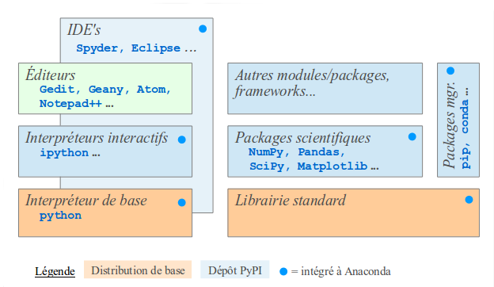

name: main-titre
layout: true
class: center, middle, inverse

---

# Atelier d'initiation à la programmation Python

Première partie

.footnote[
Jérémie Decock (www.jdhp.org)
]

---

layout: false

.left-column[
    ## Prérequis
]
.right-column[
* Bases en informatique

    - les systèmes d'exploitation
    - installer une application
    - ouvrir un terminal
    - ...

* Quelques *notions* de programmation

    - ce qu'est un langage de programmation
    - ce qu'est la *syntaxe* d'un langage
    - ce qu'est une variable et un type
    - ce qu'est une bibliothèque logicielle
    - la différence entre un compilateur et un interprète

* Quelques *notions* d'algorithmique

    - les boucles
    - les conditions
    - la logique booléenne
]

???

Cet atelier est vraiment fait pour les débutants.

Il y a quelques pré-requis,
rien de bien compliqué et
même sans ces pré-requis,
vous devriez quand même pouvoir suivre sans trop de difficultés.

* Syntaxe d'un langage : sa grammaire
* Bibliothèque : fichier qui contient des morceaux de logiciels réutilisable
  pour faire d'autres logiciels (une sorte de catalogue de composants prêts à
  l'emploi)
* Compilateur vs interprète :
    - certains langages sont *compilés* (ex: C, C++, ...)
    - d'autres sont *interprétés* (ex: Python, Perl, ...)
    - un logiciel écrit avec un langage compilé doit être transformé en
      exécutable avant de pouvoir être utilisé (c'est le *compilateur*
      qui transforme le code source en executable)
    - dans le cas d'un logiciel écrit avec un langage interprété, instructions
      écrites dans le code source sont traitées à la volée (interprété) par un
      programme appelé interpreteur (ou interprete). À aucun moment le programme
      est converti en executable, il ne peut pas marcher sans l'interprete.

---

## Objectifs

* Faire vos premiers pas en programmation Python (version 3)
    - Mettre l'accent sur la pratique

???

L'objectif de ce cours est de:
* vous aider à faire vos premiers pas en programmation Python (version 3)
* en mettant l'accent sur la pratique en vous faisant écrire du code.
    - cette présentation sera entrecoupée de plusieurs séances de mise en pratique

--

* Donner les clés pour:
    - Approfondir rapidement vos connaissances en toute autonomie
    - Concevoir rapidement de vraies applications utiles

???

Ce cours a également pour but de vous donner les clés qui vous permettront:
* d'approfondir rapidement vos connaissances en toute autonomie
* et de vous aider à concevoir rapidement de vraies applications utiles.

--

* Vous convaincre des nombreuses qualités de Python

???

Et enfin, je vais essayé de vous convaincre des nombreuses qualités de ce langage.

---

.left-column[
    ## Plan
]
.right-column[
1ère PARTIE: Une présentation générale
* [Présentation du langage Python](#presentation): histoire, ...
* [Présentation de l'environnement de programmation](#ide)

2e PARTIE: On passe à la pratique
* [Variables et types de base](#variables-types)
* [Quelques fonctions utiles](#fonctions-utiles): print(), help(), dir(), ...
* [Les commentaires](#commentaires)
* [Les opérateurs logiques et arithmétiques](#operateurs)
* [Les structures de données](#strustures-de-donnees): listes, dictionnaire, ...
* [Les structures de contrôle](#structures-de-controle): if/then/else, boucles
* [Les fonctions](#fonctions)
* [Les modules](#modules)

3e PARTIE: Pour patienter jusqu'au prochain atelier...
* [Pourquoi utiliser Python ?](#points-forts)
* [Quelques demos](#snippets)
]

???

* Présentation du langage Python: histoire et particularités

---

name: presentation
class: center, middle, inverse

## Présentation du langage Python

Histoire et particularités

---

### Qu'est-ce que Python ?

* Un langage *.red[interprété]*
* Multi-plateformes
* Open source
* Très utilisé dans l'industrie et le monde académique

.center[]

.box[
.center[Site web: [www.python.org](http://www.python.org)]
]

???

* Un langage .red[interprété]
    - Pas besoin de compiler, etc.
    - On parle aussi de langage script.
* .red[Multi-plateformes]
    - Il marche sur de nombreuses plates-formes dont:
        - Windows, MacOS, Linux
        - La plupart des systèmes Unix
        - Et même sur Android!
* .red[Open source]: le langage et son implémentation de référence (interprète,
  bibliothèque standard et outils annexes)
    - Gratuit, c'est pas le cas de tous les langages:
        - Matlab, Mathematica, IDL, etc.
        - Les licences de ces langages peuvent coûter plusieurs miliers d'euros!
    - Librement modifiable et redistribuable
        - Ce n'est pas le cas de certains langages comme C#
    - Vous pouvez regarder la mécanique interne de l'interprète Python et des
      outils qui l'accompagne si le cœur vous en dit
* .red[Très utilisé] dans l'industrie et le monde académique
    - Notamment il a de sérieux atouts pour séduire les ingénieurs et les
      scientifiques

---

### Mais encore ?

Python est un langage:
* .red[*Orienté objet*]
    - Les objets sont des structures de données complexes
* De .red[*haut niveau*]
    - Gestion automatique de la mémoire
    - Système de gestion d'exceptions
    - ...
* À .red[*typage dynamique*]
    - Le programmeur ne défini pas explicitement le type des variables

???

Si vous comprenez ce que je viens de dire, tant mieux ;

sinon c'est pas grave,

on va éviter de perdre du temps à définir tous ces
concept abstraits

qui sont importants à connaitre pour un programmeur avancé

mais qui ne sont pas indispensables pour une première approche (pragmatique et
pratique) du langage.

.comment[
> Python est un langage à *typage dynamique fort*.
> 
> Typage dynamique:
> "Le typage dynamique consiste à laisser l'ordinateur réaliser cette opération
> de typage « à la volée », lors de l'exécution du code, et de décharger donc le
> programmeur de la tâche contraignante de déclarer expressément, pour chaque
> variable qu'il introduit dans son code, son typage.
> Le typage dynamique est une solution très commode pour le développement
> rapide de programmes, où le type des objets manipulés n'est pas forcément connu
> à l'avance, ou bien où le programmeur veut permettre par commodité le
> changement de type d'une variable." (wikipedia)
> 
> Typage fort:
> "Depuis son invention, le terme de typage fort a été employé avec de nombreux
> sens contradictoires, ce qui lui a enlevé presque toute signification."
> 
> * https://fr.wikipedia.org/wiki/Typage_dynamique
> * https://fr.wikipedia.org/wiki/Typage_fort
]

---

### Un bref historique du langage

* Python 1 (1994) : n'est plus utilisé depuis longtemps
* Python 2 (2000) : toujours utilisé mais en fin de vie
* Python 3 (2008) : celui que nous allons étudier

???

Python est un langage mature.

Il a une vingtaine d'années déjà.

La première version du langage est sortie en 1994,
la seconde en 2000 et la troisième en 2008.

---

### Les sous versions

* Python 2:

    - Python 2.0 (2000)
    - Python 2.1 (2001)
    - Python 2.2 (2001)
    - Python 2.3 (2003)
    - Python 2.4 (2004)
    - Python 2.5 (2006)
    - Python 2.6 (2008)
    - **Python 2.7 (2010)**

* Python 3:

    - Python 3.0 (2008)
    - Python 3.1 (2009)
    - Python 3.2 (2011)
    - Python 3.3 (2012)
    - Python 3.4 (2014)
    - **Python 3.5 (2015)**

???

Python 1: est complètement dépassé, je n'en parlerai pas plus.

Python 2:
* Il est sorti .red[8] sous-version pour Python 2.
* La dernière en date (Python 2.7) date de 2010.
* Python 2.7 est encore très utilisé aujourd'hui.

Python 3: à ce jour, il est sorti .red[6] sous-version de Python 3.

---

### Incompatibilités

* *Python 1*, *Python 2* et *Python 3* sont **incompatibles** entre eux!

    - Un programme écrit pour *Python 2* ne fonctionnera généralement pas sur
      *Python 3*
    - Un programme écrit pour *Python 3* ne fonctionnera généralement pas sur
      *Python 2*
    - ...

* Mais les sous-versions sont compatibles entre elles:

    - Un programme écrit pour *Python 2.5* fonctionnera sur *Python 2.7*
    - Un programme écrit pour *Python 3.0* fonctionnera sur *Python 3.5*
    - ...

???

Je vous parle de versions car

il faut savoir qu'il y a des problèmes d'incompatibilités entre certaines versions.

* *Python 1*, *Python 2* et *Python 3* sont **incompatibles** entre eux!

    - Un programme écrit pour *Python 2* ne fonctionnera généralement pas sur
      *Python 3*
    - Un programme écrit pour *Python 3* ne fonctionnera généralement pas sur
      *Python 2*

* En revanche il n'y a pas de problèmes de compatibilité entre les sous-versions.

    - Un programme écrit pour *Python 2.5* fonctionnera sur *Python 2.7*
    - Un programme écrit pour *Python 3.0* fonctionnera sur *Python 3.5*
    - ...

---

### Python 2 ou Python 3 ?

.center[]

.box[
Python 2 est toujours utilisé par de nombreuses personnes !
]

Source: [www.randalolson.com/2015/01/30/python-usage-survey-2014/](http://www.randalolson.com/2015/01/30/python-usage-survey-2014/)

???

La question se pose parfois de savoir si il vaut mieux utiliser Python 2 ou Python 3.

Il y a encore beaucoup de développeurs qui pour diverses raisons préfèrent encore
utiliser Python 2 plutôt que Python 3.

---

#### Principales raisons

1. Quelques outils et bibliothèques utilisées par ces développeurs n'ont toujours pas été mises à jours pour Python 3
2. De nombreuses innovations de Python 3.X sont de toute façon portées dans Python 2.7
3. Manque de temps, de moyens ou de motivation de porter certains projets

.center[]

Source: [www.randalolson.com/2015/01/30/python-usage-survey-2014/](http://www.randalolson.com/2015/01/30/python-usage-survey-2014/)

---

#### D'accord mais pour nous ce sera **Python 3** !

* Il est assez peu probable que vous soyez concerné par le premier argument, les principales grosses bibliothèques ont déjà été portées depuis plusieurs années
* Vous débutez en python donc les arguments 2 et 3 ne sont pas valables pour vous
* Python 2 meurt (très) lentement mais surement...
* Python 3 c'est (le présent et) l'avenir !

<br />

.box[
Il existe des outils pour automatiser la conversion des programmes de Python 2
à Python 3 ([2to3](https://docs.python.org/3/library/2to3.html))
]

---

class: center, middle

## Mais au fait, pourquoi Python et pas C/C++/Java/... ?

15 bonnes raisons d'utiliser Python

---

class: center, middle

### Suspense...

Je garde ça pour la fin !

???

En attendant, place à la pratique

---

name: ide
class: center, middle, inverse

## Présentation de l'environnement de programmation Python

L'interprète Python et l'environnement de développement IDLE

???

Assez parlé, .red[passons à la pratique].

On va commencer par .red[installer l'environnement Python].

Qu'est-ce que j'entends par ".red[environnement Python]" ?

---

### Un aperçu de l'environnement (standard) de programmation Python

* *Implémentation* standard (CPython)
    - Un ***interprète*** python standard (aussi appelé CPython)
    - Une ***bibliothèque standard***
    - Un éditeur pour écrire vos programmes : IDLE
    - Divers outils : pip, 2to3, ...

* Bibliothèques externes
    - Numpy
    - Matplotlib
    - Scipy
    - Pillow
    - PyQt
    - ...

* Interprètes/éditeurs/outils externes
    - IPython
    - Sphinx
    - ...

???

Quand vous installez la version standard de Python vous avez au moins .blue[ça]...

C'est la brique de base.

* Vous pouvez installer sur votre système des .red[bibliothèques externes]
* qui vont vous permettre .red[d'étendre] la bibliothèque standard
* et d'ajouter de .red[nouvelles fonctionnalités prêtes à l'emploi]

Par exemple:
* si vous voulez faire du traitement d'image en Python, 
* vous pouvez installer la bibliothèque externe Pillow
* qui vous fournira tout ce dont vous avez besoin

---

### Installation de Python : la méthode classique...

<br />
<br />
<br />
<br />
<br />
<br />
<br />
<br />

.box[
.center[[www.python.org](http://www.python.org)]
]

---

class: center, middle

### Alternative : les distributions

Qu'est-ce que c'est ?

---

#### Avec l'installation standard

* *Implémentation* standard (CPython)

    - Un ***interprète*** python standard (aussi appelé CPython)
    - Une ***bibliothèque standard***
    - Un éditeur pour écrire vos programmes : IDLE
    - Divers outils : pip, 2to3, ...

.grey[
* Bibliothèques externes

    - Numpy
    - Matplotlib
    - Scipy
    - ...
]

.grey[
* Interprètes/éditeurs/outils externes

    - IPython
    - Sphinx
    - ...
]

---

#### Avec une distribution

* *Implémentation* standard (CPython)

    - Un ***interprète*** python standard (aussi appelé CPython)
    - Une ***bibliothèque standard***
    - Un éditeur pour écrire vos programmes : IDLE
    - Divers outils : pip, 2to3, ...

* Des bibliothèques externes préinstallées

    - Numpy
    - Matplotlib
    - Scipy
    - ...

* Des interprètes/éditeurs/outils externes supplémentaires

    - IPython
    - Sphinx
    - ...

---

### Quelques exemples de distributions Python

<br />
<br />
<br />
<br />

* [Anaconda](https://www.continuum.io/)
* [Enthought Canopy](https://www.enthought.com/)
* [Python(x,y)](http://python-xy.github.io/)
* [ActivePython](http://www.activestate.com/activepython)

---

### Pourquoi utiliser une distribution ?

Pour nous simplifier la vie ! (surtout sur Windows)

Ça nous évite d'installer un par un les outils externes
et les bibliothèques externes dont on a besoin

Autres avantages:
* Une mise à jour simplifiée des bibliothèques et des outils
* Un ensemble de bibliothèques cohérent (pas de problèmes d'incompatibilités)
* La gestion des .red[dépendances]
* ...

???

Pour nous .red[simplifier la vie]...

C'est surtout valable pour les utilisateurs de Windows...

Ça nous évite d'installer un par un les .red[outils externes]
et les .red[bibliothèques externes] qu'on pourrait être amené à devoir utiliser...

Il y a d'autres avantages:
* la .red[mise à jour simplifiée] des bibliothèques et des outils
* avoir un .red[ensemble de bibliothèques cohérent] où il n'y a pas de
  problèmes de versions de bibliothèques incompatibles
* la gestion des .red[dépendances]
* ...

.comment[Pour ceux qui connaissent PIP, il faut savoir que certaines bibliothèques
ne peuvent pas être installées avec PIP (ex: numpy), alors que la plupart sont
préinstallées ou facilement installables avec les distributions.]

---

### Anaconda et Miniconda

Anaconda et Miniconda contiennent:
* Des .red[bibliothèques externes] qui ne sont pas disponibles sur PyPI:
    - Numpy
    - PyQt
    - ...
* L'interprète amélioré .red[IPython]
* L'application .red[Jupyter] pour créer et utiliser des *notebooks*
* Les éditeurs .red[Spyder], .red[Sublime Text 2] et .red[PyCharm]

.center[]

---

### Installer Anaconda (ou Miniconda)

Anaconda:
* Contient plus de [300 bibliothèques](http://docs.continuum.io/anaconda/pkg-docs) externes Python
* ~380 Mo sous Windows
* ~270 Mo sous MacOSX

Miniconda:
* Une version allégée, vous choisissez les bibliothèques à installer
* ~30 Mo sous Windows
* ~20 Mo sous MacOSX

.box[
.center[[www.continuum.io](https://www.continuum.io/)]
]

???

On va installer Anaconda.

Une des distribution Python les plus connues est les plus réputées.

.red[**Vous utilisez tous Windows ?**]

.todo[télécharger Anaconda et le mettre sur le serveur de fichier du Volab pour éviter d'attendre 1h que tt le monde télécharge les 600Mo du paquet le jour de l'atelier...]
.todo[imprimer le cheatcode conda, tester l'install et l'appel de conda sur Windows]

---

### L'interprète python

#### Ouvrir l'interprète en mode interactif

* Lancer l'interprète Python depuis un terminal

    - Windows: `python`
    - MacOSX, Linux, Unix: `python3`

* Taper la ligne suivante dans l'interprète

```python
print("hello")
```

* Taper `Ctrl+d` pour quitter l'interprète

---

#### Exécuter un fichier Python depuis un terminal

* Écrire la ligne précédente dans un fichier appelé "test.py" avec votre
  éditeur de texte préféré

```python
print("hello")
```

* Exécuter le fichier depuis un terminal

    - Windows: `py test.py` ou `python test.py`
    - MacOSX, Linux, Unix: `python3 test.py`

---

#### Exécuter un fichier Python depuis l'explorateur de fichiers

* Écrire le programme suivant dans un fichier appelé "test_graphique.py" avec
  votre éditeur de texte préféré

```python
#!/usr/bin/env python3

import tkinter as tk

root = tk.Tk()

label = tk.Label(root, text="Bonjour !", font="Sans 30 bold")
label.pack()

root.mainloop()
```

* Double cliquer sur votre fichier "test_graphique.py"

.box[
**Remarque:** il est peut être préférable d'appeler ce programme
"test_graphique.pyw" sur Windows pour ne pas ouvrir un terminal inutile...
]

---

### L'environnement de développement IDLE

IDLE
* L'*IDE* "officiel" de Python
* Intégré de base avec Python (standard): rien à installer
* Écrit en Python
* Open source

Pourquoi IDLE ?
* Un classique
* Intégré de base avec Python: si vous avez Python, vous avez IDLE (sauf cas particuliers)
* Fonctionne sur Windows, MacOSX, Linux, ...
* Fonctionnalités basiques mais adaptées aux besoins de cet atelier
    - Ni trop simple, ni trop compliqué

---

#### Les alternatives à IDLE

Si IDLE ne vous plaît pas

* [PyCharm](http://www.jetbrains.com/pycharm/)
* [Spyder](https://github.com/spyder-ide/spyder/)
* Et les autres: Notepad++, Code::Blocks, Eclipse, ...

.box[
Vous pouvez aussi faire votre choix [ici](https://en.wikipedia.org/wiki/Comparison_of_integrated_development_environments#Python)
]

???

Aujourd'hui on va utiliser IDLE

Si il ne vous plait pas, il existe plein d'alternatives

Personnellement je n'utilise pas d'IDLE pour écrire mes programmes Python...

Mais je trouve qu'il est bien adapté pour cet atelier.

---

#### Écriture de programmes Python avec IDLE

##### 1. Démarrer IDLE

* Taper `idle` depuis une console

???

À l'ouverture d'IDLE vous avec une console (Shell) pour interagir directement
avec l'interprète Python

--

##### 2. Créer un nouveau programme

* "File / New File" .comment[(Ctrl + n)]

Une nouvelle fenêtre apparaît : l'éditeur de code Python

--

##### 3. Écrire notre programme

Écrire le programme suivant dans la fenêtre d'édition

```python
print("hello")
```

--

##### 4. Sauvegarder notre programme dans un fichier Python (.py)

* "File / Save" .comment[(Ctrl + s)]

---

##### 5. Exécuter notre programme

* "Run / Run module" .comment[(F5)]

Le résultat est affiché dans la console IDLE ("Shell")

--

##### Et bien sûr...

Vous pouvez exécuter notre programme depuis une console du système ou depuis
l'explorateur de fichiers

Comme dans les exemples précédents...

???

Ça c'est juste pour vous dire que bien sûr, une fois que vous avez fini
d'écrire votre programme, vous n'avez plus besoin d'IDLE pour l'exécuter...

---

#### Ouvrir un programme existant

* "File / Open" .comment[(Ctrl + o)]

--

#### Ouvrir un module de votre bibliothèque standard Python (ou d'une bibliothèque externe installée)

* "File / Open Module" .comment[(Alt + m)]

Tapez `random` dans le champ de recherche et appuyez sur Ok.

---

#### Utilisation de l'interprète interactif dans IDLE

##### 1. Revenez sur la console (ou le fenêtre "Shell")

Ou depuis le menu: "Run / Python Shell"

--

##### 2. Tapez directement la ligne suivante:

```python
print("hello")
```

--

.box[
**Astuce :** pour copier coller plus vite dans la console IDLE, sélectionnez le
texte et appuyez sur la touche `Entrer`
]

---

name: variables-types
class: center, middle, inverse

## Variables et types de base

---

### Qu'est-ce qu'une variable ?

C'est un espace de stockage dans la mémoire de l'ordinateur (une "case") caractérisé par:
* Un .red[nom]: qu'on utilise pour désigner la variable dans le programme
    - Exemples: "var", "x", "toto", ...
* Une .red[valeur]: le contenu de la variable
* Un .red[type]: on verra ça juste après
* Une .red[portée]: on verra ça plus tard...

Un programme utilise des variables pour stocker des données temporaires

---

### Affecter une valeur à une variable

Exemple:
```python
x = 3
y = 18
```

* `x` est le nom de la 1ère variable et `3` sa valeur
* `y` est le nom de la 2e variable et `18` sa valeur

---

#### Règles de nommage

Les noms de variables doivent obéir à certaines règles:
* les lettres de `a` à `z` en minuscule ou en majuscule
* le caractère "underscore" : `_`
* les chiffres (mais un nom de variable ne doit pas commencer par un chiffre)

Exemples de noms corrects:
```python
x = 3
AbC = 3
x8 = 3
une_variable = 3
```

Exemples de noms incorrects:
```python
une variable = 7
supervariable! = 19
8x = 19
une-variable = 3
```

???

.comment[https://docs.python.org/3/reference/lexical_analysis.html#identifiers]

---

#### Conventions de nommage

En plus des règles précédentes, il existe des conventions (i.e. pas
obligatoires mais recommandées)

.box[
.center[Voir les [PEP 8](https://www.python.org/dev/peps/pep-0008/)]
]

Pour les noms de variables:
* éviter d'utiliser des lettres en majuscule (les noms avec des majuscules sont
  réservés à autre chose)
* utiliser le caractère underscore (`_`) pour les noms composés

Exemple:

```python
nom_etudiant = "John"
nom_prof = "Alice"
```

???

.comment[https://www.python.org/dev/peps/pep-0008/]

---

### Le type d'une variable

Le *type* caractérise la valeur d'une variable

Les .red[nombres entiers]
```python
var = 5
var = -179756579879372368792803
```

Les .red[nombres décimaux] (notation anglaise!)
```python
var = 31.141592
var = -0.162
```

Les .red[chaînes de caractères] (notées entre guillemets)
```python
var = "Bonjour"
var = "a"
```

Les .red[booléens] ("vrai" ou "faux")
```python
var = True
var = False
```

???

Le type : ce qui caractérise la valeur d'une variable

Les .red[nombres décimaux] : notation anglaise = `.` et non pas `,`

Booléens = seulement deux valeurs : "vrai" ou "faux"

---

Les chaînes de caractères sont internationalisées ("Unicode")
```python
var = "你好"
var = "العربية"
```

Elles peuvent contenir des caractères de ponctuation et des caractères spéciaux
```python
var = "Hello\nWorld!"
var = "http://www.jdhp.org"
var = "jd.jdhp@gmail.com"
```

???

Les chaînes de caractère ne sont pas limitées aux caractères latin (ASCII)

---

### Afficher la valeur d'une variable: la fonction `print()`

```python
x = 3
print(x)
```

```python
var = "bonjour"
print(var)
```

---

### Afficher le type d'une variable: la fonction `type()`

Chaîne de caractères: `str`
```python
s = "Bonjour"

print(s)
print(type(s))
```

Nombres entiers: `int`
```python
n = 123

print(n)
print(type(n))
```

Nombres décimaux: `float`
```python
x = 0.1

print(x)
print(type(x))
```

---

Booléens: `bool`
```python
b = True

print(b)
print(type(b))
```

---

### Python est un langage à *typage dynamique*

On dit que Python est un langage à *typage dynamique* : 
une variable peut changer de type

```python
var = "Bonjour"

print(var)
print(type(var))

var = 123

print(var)
print(type(var))

var = 0.1

print(var)
print(type(var))
```

---

### Les conversions de type

On peut modifier le type d'une valeur ou d'une variable
avec les fonctions `int()`, `float()` et `str()`

```python
x = 1

x = str(x)
print(x)
print(type(x))

x = int(x)
print(x)
print(type(x))

x = float(x)
print(x)
print(type(x))
```

Il existe aussi une fonction de conversion pour les booléens: `bool()`

---

name: fonctions-utiles
class: center, middle, inverse

## Quelques fonctions utiles

---

### Mais au fait, c'est quoi une fonction ?

* Un nom suivi de parenthèses

* Effectue des opérations

* On peut lui communiquer des objets en entrée (arguments)

* Elle peut retourner un résultat

Exemple:

```python
foo()
```

```python
x = "hello"
bar(x)
```

```python
x = baz(3)
```

???

Si c'est pas très clair à ce stade là c'est pas très grave

On étudiera vraiment les fonctions qu'à la fin de l'atelier

---

### La fonction print()

Afficher la valeur d'une variable

```python
x = 3
print(x)

s = "bonjour"
print(s)
```

Afficher un message

```python
print("bonjour")
```

Afficher le résultat d'une opération

```python
print(12 * 6)
```

Etc.

???

On a déjà vu la fonction print()

---

### La fonction type()

Obtenir le type d'une variable

```python
s = "Bonjour"

print(type(s))
```

```python
n = 123

print(type(n))
```

```python
x = 0.1

print(type(x))
```

???

On a déjà vu la fonction print()

---

### La fonction input()

Obtenir une valeur saisie par l'utilisateur

```python
s = input()

print(s)
print(type(s))
```

Attention: la valeur retournée est toujours une chaîne de caractères

---

### La fonction help()

* Pour consulter l'aide en ligne à propos d'une variable, d'une fonction, etc.

* Appuyez sur les flèches haut/bas pour faire défiler

* Appuyez sur `q` pour quitter l'aide en ligne

```python
s = "bonjour"

help(s)
```

```python
help(print)
help(type)
```

---

### La fonction dir()

Afficher la liste de tous les *objets* instanciés

```python
s = "Bonjour"
x = 3

print(dir())
```

Afficher la liste des méthodes d'un *objet*

```python
s = "Bonjour"

print(dir(s))
```

???

.todo[bof...]

---

name: commentaires
class: center, middle, inverse

## Les commentaires

---

### Ajouter un commentaire

* Un commentaire est une chaîne de caractère qui commence par `#` et qui se
  termine par le retour à la ligne

* Les commentaires servent à documenter le code du programme

* Ils servent uniquement d'indication au programmeur, ils sont ignorés par
  l'interprète Python

```python
# Ceci est un commentaire
x = 0.1
y = 4

print(x)  # Voici un autre commentaire

# Un commentaire
# sur plusieurs lignes
print(y)
```

Il est important de documenter (intelligemment) le code source d'un programme !

---

name: operateurs
class: center, middle, inverse

## Les opérateurs logiques et arithmétiques

---

### Opérateurs arithmétiques (nombres entiers et décimaux)

Addition, soustraction
```python
print(3 + 4)
print(10.0 + 1.5)
print(15 - 2)
```

```python
n1 = 3
n2 = 4

print(n1 + n2)
print(n1 - n2)
```

```python
n1 = 3
n2 = 4
n3 = n1 + n2
n4 = n1 - n2

print(n3)
print(n4)
```

---

Conversions de types automatiques

```python
n1 = 3
n2 = 0.1
n3 = n1 + n2

print(type(n1))
print(type(n2))
print(type(n3))
```

---

Multiplication, division
```python
print(3 * 4)
print(10.0 * 1.5)
print(15 / 2)
```

```python
n1 = 3
n2 = 4

print(n1 * n2)
print(n1 / n2)
```

```python
n1 = 3
n2 = 4
n3 = n1 * n2
n4 = n1 / n2

print(n3)
print(n4)
```

---

Conversions de types automatiques

```python
n1 = 3
n2 = 4
n3 = n1 / n2

print(type(n1))
print(type(n2))
print(type(n3))
```

???

Conversion automatiques:

```python
print(type(15 / 2))
```

---

On peut enchaîner les opérateurs

```python
var = 3 + 4 - 2 + 0.1
```

On peut mettre des parenthèses comme en maths

```python
var = 20 * (4 - 0.1)
print(var)

var = 20 * 4 - 0.1
print(var)
```

???

Suivant qu'on a ou pas les parenthèses, ça ne donne pas le même résultat (comme
en maths)

---

### Opérateurs de comparaison

* Opérateur "test d'égalité" (`==`)

```python
var1 = 10
var2 = 5

print(var1 == var2)
```

--

* Opérateur "test d'inégalité" (`!=`)

```python
var1 = 10
var2 = 5

print(var1 != var2)
```

---

* Les autres opérateurs de comparaison (`<`, `>`, `<=` et `>=`)

```python
var1 = 10
var2 = 5
var3 = 5

print(var1 < var2)

print(var1 <= var2)
print(var2 <= var3)

print(var1 > var2)

print(var1 >= var2)
print(var2 >= var3)
```

---

### Opérateurs logiques (booléens)

On en aura surtout besoin pour les tests de branchements (instruction `if`)

Opérateur *ET* (`and`)
```python
print(True and True)
print(True and False)
print(False and True)
print(False and False)
```

```python
res = (3 < 0) and (1 > 0)
print(res)
```

---

Opérateur *OU* (`or`)
```python
print(True or True)
print(True or False)
print(False or True)
print(False or False)
```

```python
res = (3 < 0) or (1 > 0)
print(res)
```

---

Opérateur *NON* (`not`)
```python
print(not True)
print(not False)
```

```python
var = True
print(not var)
```

---

### Exercice

Écrire dans un fichier Python un programme qui:
* Affiche un message pour demander à l'utilisateur de saisir un nombre
* Récupère le nombre saisi
* Affiche sa valeur multipliée par 2

Tester le programme en l'appelant comme n'importe quel autre logiciel (double clic)

???

```python
print("Entrez un nombre entier: ", end="")
s = input()
n = int(s)
print(n * 2)
```

---

name: strustures-de-donnees
class: center, middle, inverse

## Les structures de données

---

### Les listes

<br />

.box[
.center[Une liste est une séquence de valeur]
]

Créer une liste initialisée
```python
l = ["Bonjour", 2.1, 3]
```

Créer une liste vide
```python
l = []
```

Ajouter des éléments à la fin de la liste
```python
l.append(2)
l.append("hello")
l.append(3.14)
```

???

Se notre entre crochets

.blue[Dessiner au tableau...]

---

Obtenir le 1er élément de la liste
```python
l[0]
```

Obtenir le 2e élément de la liste
```python
l[1]
```

Obtenir le 3e élément de la liste
```python
l[2]
```

???

Obtenir:
* affecter à une variable
* afficher

---

Modifier le 2e élément de la liste
```python
l[1] = "bonjour"
```

Supprimer le 2e élément de la liste
```python
del(l[1])
```

Effacer une liste
```python
l.clear()
```

---

Obtenir la taille d'une liste
```python
l = [1, 2, 3]
len(l)
```

```python
l = ["hello", "world"]
len(l)
```

???

Pour simplifier les slides, je ne mets plus les "print()"

---

Vérifier si un élément est dans une liste...
```python
l = ["hello", "world"]
"bonjour" in l
"hello" in l
```

ou le contraire
```python
l = ["hello", "world"]
"bonjour" not in l
"hello" not in l
```

???

Exemple:
```python
print("bonjour" in l)
print("hello" in l)
```

---

Concaténer deux listes
```python
l1 = ["hello", "world"]
l2 = [3, 4]
l1 + l2
```

Trier une liste
```python
l = [16, -2, 3, 0.1]
l.sort()
```

Inverser une liste
```python
l = ["a", "b", "c", "d"]
l.reverse()
```

---

### Les tuples

Créer un tuple initialisé...
```python
t = ("Bonjour", 2.1, 3)
```

Obtenir le 2e élément d'un tuple
```python
t[1]
```

Obtenir la taille d'un tuple
```python
l = (1, 2, 3)
len(l)
```

Vérifier si un élément est dans un tuple...
```python
t = ("hello", "world")
"bonjour" in t
"hello" in t
"world" not in t
```

???

Un tuple c'est comme une liste sauf qu'on ne peut pas le modifier.

L'intérêt est que ça prend moins de place en mémoire et que c'est plus rapide à manipuler.

Se note entre parenthèses

Mutable vs Imutable

---

Convertir un tuple en liste
```python
t = (1, 2, 3)
l = list(t)
```

Convertir une liste en tuple
```python
l = [1, 2, 3]
t = tuple(l)
```

---

class: center, middle

### Les autres structures de données

Les *ensembles* et les *dictionnaires*... ça sera pour une autre fois :-)

???

Il y a au moins 2 autres types de structures de données à connaitre
* les ensembles
* les dictionnaires

mais j'en parlerais pas cette fois ci, pour pas que l'atelier soit trop indigeste...

---

name: structures-de-controle
class: center, middle, inverse

## Les structures de contrôle

---

### If/Then/Else

...

---

### Boucles For

...

range()

---

### Boucles While

...

---

name: fonctions
class: center, middle, inverse

## Les fonctions

---

### ...

...

---

name: modules
class: center, middle, inverse

## Les modules

---

### ...

...

---

name: points-forts
class: center, middle, inverse

## Pourquoi utiliser Python ?

15 bonnes raisons d'utiliser Python

---

### Une syntaxe légère, efficace et agréable à lire 

* Une syntaxe discrète
    - code court et facile à lire

* Un système de délimitation des blocs de code basé sur l'indentation
    - singulière, originale mais surtout efficace!

.box[
Un langage facile à apprendre !
]

Exemple de code Python:

```python
l = [2, 3, 5]

for n in l:
    print(n)
```

---

L'équivalent en C++ (11):

```cpp
#include <vector>
#include <iostream>

int main() {

    std::vector<int> v {2, 3, 5};    // Ne marche pas pour C++98

    std::vector<int>::iterator it;
    for(it = v.begin() ; it != v.end() ; it++) {
       std::cout << *it << std::endl;
    }

    return 0;
}
```

???

Ne cherchez pas à comprendre le code...

Si vous le comprenez, tant mieux...

mais ça n'est pas le but.

---

L'équivalent en Java:

```java
import java.util.ArrayList;
import java.util.Arrays;

public class Test {

    public static void main(String[] args) {

        ArrayList<Integer> list = new ArrayList<Integer>(Arrays.asList(2, 3, 5));

        for(int val : list) {
            System.out.println(val);
        }
    }
}
```

---

### Un cycle de développement (très) court

* Un langage interprété
    - Pas d'étape de compilation
    - On peut tester du code à la volée (et avec IPython c'est encore mieux!)
    - Pas d'infrastructure complexe avec des makefile, etc.

* Les fichiers code source n'ont pas besoin d'être rangé d'une façon particulière
    - Contrairement au langage Java
    - Ex: ...

* Typage dynamique
    - L'utilisateur n'a pas besoin de déclarer explicitement le type de chaque
      variable
    - Pas besoin d'écrire un fichier "header" (.h) pour chaque module contrairement au C/C++
    - Gain de temps
    - Code plus compact

* Gestion de la mémoire automatique par ramasse-miettes
    - L'utilisateur n'a pas besoin d'allouer/désallouer manuellement la mémoire des variables dynamiques
    - Moins de risques de bugs
    - Gain de temps
    - Code plus compacte

???

En clair,

à niveau de compétence équivalent,

ça prend généralement beaucoup (beaucoup) moins de temps d'écrire une application en Python

qu'en C, C++, Java, etc.

---

### Des types de base très puissants et faciles à utiliser

* Les listes
* Les dictionnaires
* Les ensembles

Par exemple, une liste chainée (tableau dynamique):

<br />

.center[]

???

Comparons Python, C++, C et Java sur un exemple simple: une liste chainée (tableau dynamique).

C'est une structure de données très simple et très souvent utilisée.

---

En C++ (11):

```cpp
#include <vector>
#include <iostream>

int main() {

    std::vector<int> v {2, 3, 5};    // Ne marche pas pour C++98

    v.push_back(7);

    std::vector<int>::iterator it;
    for(it = v.begin() ; it != v.end() ; it++) {
       std::cout << *it << std::endl;
    }

    return 0;
}
```

???


Ne cherchez pas à comprendre le code...

Si vous le comprenez, tant mieux...

mais ça n'est pas le but.

---

En Java:

```java
import java.util.ArrayList;
import java.util.Arrays;

public class Test {

    public static void main(String[] args) {

        ArrayList<Integer> list = new ArrayList<Integer>(Arrays.asList(2, 3, 5));

        list.add(7);

        for(int val : list) {
            System.out.println(val);
        }
    }
}
```

---

En C:

```c
#include <stdlib.h>
#include <stdio.h>

typedef struct list {
    int data;
    struct list * next;
} list;

list * make_elem(void) {
    list * pe;

    if(NULL == (pe = malloc(sizeof(list)))) {
        fprintf(stderr, "Erreur d'allocation memoire\n");
        exit(EXIT_FAILURE);
    }

    return pe;
}

...
```

---

En C (suite):

```c
...

int main() {

    list *pl, *pe1, *pe2, *pe3, *pe4;

    list * pe1 = make_elem();
    list * pe2 = make_elem();
    list * pe3 = make_elem();
    list * pe4 = make_elem();

    pe1->data = 2;
    pe2->data = 3;
    pe3->data = 5;
    pe4->data = 7;

    pl = pe1;

    pe1->next = pe2;
    pe2->next = pe3;
    pe3->next = pe4;
    pe4->next = NULL;

    ...
```

---

En C (fin):

```c
    ...

    list * c;

    for(c=pl ; c ; c=c->next) {
        printf("%d\n", c->data);
    }

    free(pe1);
    free(pe2);
    free(pe3);
    free(pe4);

    return 0;
}
```

Ouf...

---

En Python:

```python
l = [2, 3, 5]

l.append(7)

for n in l:
    print(n)
```

* Côté facilité d'utilisation Python est imbattable !

* La différence est toute aussi marquée (voir plus) pour les autres structures de
  données : dictionnaires, ensembles, etc.

* Quand on sait que ce type de structures sont très utilisées dans la plupart des
  programmes, vous imaginez facilement l'impact sur la concision et la lisibilité
  du code... 

???

Ce que je vous ai montré reste très basique...

---

On est bien content d'utiliser Python quand on a affaire à des structures imbriquées !

```python
l = [[2, 3], [5, 7]]

l.append([11, 13])

for n1 in l:
    for n2 in n1:
        print(n2)
```

En C++ et en Java le code équivalant ne tiendrait tout juste sur ce slide...

???

On est bien content d'utiliser Python quand on a affaire à des structures imbriquées !

---

### Un langage multi-plateforme

Permet d'écrire des logiciels portables:
* Pas besoin de créer une version spécifique de votre programme pour chaque systèmes d'exploitation

* Il marchera sans modification (à quelques rares exceptions près) sur:
    - Windows
    - MacOS
    - Linux
    - De [nombreuses autres plateformes](https://www.python.org/download/other/)

???

* Pas besoin de créer une version spécifique de votre programme pour chaque systèmes d'exploitation
* (i.e. "compiler" / adapter le code)
* (contrairement au C/C++)

---

### Une bibliothèque standard très riche ("Batteries included") 

mettre ici un schéma avec plusieurs cercles concentriques:
- le langage python: les ~classes/fonctions~ internes
- la bibliothèque standard: toutes les fonctionnalités ("modules") livrés avec le langage (ie. rien à installer) -> montrer la liste sur la page de doc de python.org
- les nombreux paquets externes (à installer au cas par cas)

---

### Une énorme base de développeurs, d'utilisateurs et de bibliothèque externes

* Très utilisé dans l'industrie et le monde académique
    - Universités
    - NASA
    - CERN
    - Google
    - Youtube
    - ...

.box[
* [brochure.getpython.info/learn-more](http://brochure.getpython.info/learn-more)
* [www.python.org/about/success/](http://www.python.org/about/success/)
]

* Une grosse base de développeurs aussi
    - Un gage de pérennité
    - Pas juste un effet de mode
    - Apprendre Python est rentable aussi sur le long terme

---

### Un langage très généraliste

Bibliothèque standard + bibliothèques externes.

On peut presque tout faire avec:
- interfaces graphiques
- calcul scientifique (algèbre, analyse, statistiques/probas, théorie des graphs (pygraph), visualisation, etc.)
- calcul formel avec Sympy (un peu comme Maple, Mathematica et Maxima)
    - calculer la dérivée ou l'intégrale d'une fonction, résoudre une équation, factorisation, calcul de limites, résolution de systèmes d'équations, ...
- informatique haute performance / calcul massivement parallèle
- chimie, [biologie](http://biopython.org), astronomie, [psychologie](http://www.psychopy.org), [finance](http://quantlib.org), etc.
- optimisation, apprentissage automatique, traitement du signal, ...
- serveurs
- multimédia
- 3D
- jeux
- traitement d'image
- applications web
- systèmes embarqués (robotique, etc.)
- bases de données
- réseau
- outils système
- greffons (plugins) pour Blender, The Gimp, Inkscape, FreeCAD, OpenOffice, etc.
- manipulation/édition de fichiers, documents, ... (PDF, HTML, XML, etc.)
- cartographie (http://matplotlib.org/basemap/, http://matplotlib.org/basemap/users/examples.html, https://jakevdp.github.io/blog/2015/08/14/out-of-core-dataframes-in-python/)
- ...

???

TODO: https://www.python.org/about/apps/

TODO: http://sametmax.com/tres-grand-listing-des-libs-tierce-partie-les-plus-utiles-en-python/

TODO: faire apparaître les items un par un et mettre une image dans la colonne
de gauche pour chaque item.

---

### Ipython

Une console interactive très puissante, conviviale et utile:
* conviviale: autocomplétion, navigation dans l'historique, etc.
* explorer des modules
* vérifier la signature d'une fonction, le type d'un objet, etc.
* afficher le code source d'une fonction ou d'un module
* retrouver l'emplacement d'un module
* tester des bouts de code
* consulter la documentation intégrée
* lister les objets accessibles dans l'espace de nom courant, rechercher un objet à partir d'un motif
* rechercher une fonction/une méthode
* vérifier leur occupation en mémoire des objets instanciés
* profiler une fonction (mesurer son temps d'exécution)
* facilite l'utilisation du debugger interactif
* introspection, reflexivité, etc.
* parfaite intégration à matplotlib pour tracer des courbes directement depuis le terminal (comme gnuplot, etc.)
* ...

Je ne connais aucun langage qui propose une console aussi utile et puissante.

Ça permet de raccourcir considérablement le cycle de développement d'un programme.

En C/C++ ou en Java:
* il faut se débrouiller avec une documentation statique (Doxygen ou Javadoc) généralement incomplète (quand elle existe) et difficile à comprendre
* si on veut tester une fonction ou une classe, il faut:
    - créer un fichier source dans le bon répertoire
    - écrire le code que l'on veut tester dedans avec toutes les déclarations nécessaires : includes, main, etc.
    - sauvegarder le fichier
    - le compiler
    - l'exécuter
    - regarder le résultat
    - retourner en 2 pour ajuster le code suivant le résultat (si nécessaire)...

???

TODO: un tuto très intéressant: http://eric-pommereau.developpez.com/tutoriels/introduction-ipython/

TODO: http://sametmax.com/quelques-bonnes-raisons-de-plus-dutiliser-ipython/

Si vous n'avez pas compris ce que j'ai dit, retenez seulement qu'Ipython c'est
super et qu'à ma connaissance aucun autre langage ne propose une console aussi
conviviale et puissante.

---

### Jupyter

notebooks: pour faire des tutoriels interactifs sur le web.

Très utile pour enseigner le langage ou une de ses bibliothèques, faire des démonstrations sur le web, etc.

Exemple: ...

???

TO READ: http://blog.ouseful.info/2014/12/12/seven-ways-of-running-ipython-notebooks/

http://nbviewer.ipython.org/
https://github.com/ipython/ipython/wiki/A-gallery-of-interesting-IPython-Notebooks
http://sametmax.com/profiter-du-notebook-de-ipython/
http://www.randalolson.com/2012/05/12/a-short-demo-on-how-to-use-ipython-notebook-as-a-research-notebook/
https://azure.microsoft.com/fr-fr/documentation/articles/virtual-machines-python-ipython-notebook/
http://jupyter.readthedocs.org/en/latest/subprojects.html

---

### Numpy, Matplotlib et SciPy

À elles seules, ces trois bibliothèques étroitement liées et parfaitement
intégrée à l'écosystème Python (IPython, Jupyter, etc.) peuvent suffire à
convaincre beaucoup d'utilisateurs tant elles sont utiles et puissantes...

Elles sont sans doute la principale raison du succès de Python chez les
industriels dans la communauté scientifique.

Python + Numpy/Matplotlib/Scipy = la puissance et la convivialité d'un Matlab
combinée à la richesse d'un vrai langage généraliste... qui plus est libre et
gratuit!

Je ne connais aucun autre langage généraliste qui propose des bibliothèques
aussi riche et bien intégrées pour le calcul scientifique.

Cet argument ne concerne pas seulement les scientifiques et les ingénieurs, tracer des graphs, etc. -> fablabs, finance, etc. (MsExcel)

---

### Des outils pour faciliter la distribution de vos programmes Python

PIP, PyPi

Anaconda, etc. : une "distribution" Python pour Windows/MacOSX/Linux -> Python + de nombreux paquets externes
Intérêt: un python classique avec en plus de nombreux paquets externes préinstallés et un système pour garder les paquets à jours

---

### Open source

pas de problèmes de licence ou de brevets (contrairement à C# ou à Java à ses débuts)
n'importe qui peut étudier la mécanique interne de Python et améliorer le code source de ses outils (interprètes, debuggeur, etc.)
n'importe qui peut proposer ... PEP

---

### Un langage indépendant

Python n'appartient à aucune entreprise

Il est géré par la [Python Software Foundation (PSF)](https://www.python.org/psf/), une association à but non lucratif

N'importe qui peut proposer des améliorations pour les futures version du langage via le mécanisme de [PEPs](https://www.python.org/dev/peps/)

???

L'évolution du langage n'est par dirigée par des intérêts privés (je pense par exemple à C#...)

PEPs = Python Enhancement Proposals


> L'évolution du langage est dirigée par Guido van Rossum, BDFL ("Benevolent Dictator For Live") Dictateur bienveillant/bénévole à vie

---

### Extending/embeding with C/C++/C#/Java/...

Un développeur expérimenté peut facilement porter une bibliothèque C/C++/C#/Java/... en Python...

Également utile pour les programmes exigents en terme de performances: les sections de code critiques peuvent être écrite en C/C++
=> C + Python = on peut tout faire!
=> une énorme base de code supplémentaire accessible depuis Python

Embarquer python dans un logiciel écrit en C/C++/Java/... pour pouvoir executer du code Python dans ce logiciel (utile pour l'écriture de greffons).

---

### Une documentation intégrée

* Le système de documentation intégré est particulièrement efficace
    - Les *docstrings*
        - Le code et la documentation sont étroitement imbriqués
        - Pour documenter les modules, les classes, les fonctions, etc.
    - Accessible partout avec la fonction help()
    - Mise en forme avancée avec Sphinx
        - HTML
        - PDF
        - Rédaction scientifique en LaTeX
        - Readthedocs.org
    - Les Doctests

???

Montrer un exemple de la fonction help() avec numpy par exemple
-> très pratique avec IPython

Expliquer l'importance de regrouper code et documentation au même endroit

Montrer un exemple de code documenté et le résultat sur sphinx

---

### Quelques idées reçues

* "Python est lent..."
    - Cf. PyGamma15
    - La façon dont est écrit un programme compte tout autant que le langage lui même...

* "Le typage dynamique est source d'erreurs"
    - Tout dépend du programmeur... avec un peu de rigueur et de bon sens tout va bien
    - Faire des tests unitaires, documenter chaque fonction, etc.

* "L'indentation obligatoire est pénible (tabulation vs espaces, garder toujours le même nombre d'espaces, etc.)"
    - Il suffit de régler correctement son éditeur de texte une bonne fois pour toute : 1 tabulation = 4 espaces

* "Python découvre les erreurs au cours de l'exécution du programme, i.e. trop
  tard... Au moins avec le langage C/C++/Java/... le compilateur me retourne
  toutes les erreurs au moment de la compilation, i.e. avant l'exécution." 
    - Les compilateurs (C/C++/Java/...) ne retournent pas toutes les erreurs, loin de là
    - Il existe plein d'outils en Python pour faire de l'analyse de code *statique* (i.e. à froid):
        - pylint
        - 

---

name: snippets
class: center, middle, inverse

### Et pour finir, un avant gout du potentiel de Python

... avec des exemples concrets !

---

Télécharger mes *snippets* dans le répertoire "python" du projet [https://github.com/jeremiedecock/snippets](https://github.com/jeremiedecock/snippets)

Présentation des trucs cool (sans code) qu'on peut faire avec Python (distinguer les modules/paquets internes et externes)

.left-column[
* argparse
* json
* mayavi
* pandas
* multiprocessing
* pdb
* pickle
* poppler
* pygame
* pydot
* sympy
* raspberrypi...
* xml...
]
.right-column[
* scikitlearn
* astropy ???
* cairo
* cvxopt
* tkinter / pygtk / pyqt / ...
* Numpy (externe)
* Matplotlib (externe)
* Sympy
* Python serial
* Sphinx
* Beautifulsoup
* Pillow (PIL)
* OpenCV
* MPI4Py
]

???

TODO: mettre ça autre part

---

## Et après ?

* Les autres structures de données: dictionnaires, ensembles, ...
* Les classes (POO)
* Les exceptions
* Approfondir les chaînes de caractères:
    - format(), méthodes du type "string", ...
* Approfondir la fonction print()
* Lecture/écriture de fichiers
* Les itérateurs et les générateurs
* La "compréhension" de liste, de dictionnaire et d'ensmble
* Les structures de données imbriquées
* Les slices (pour les séquences)
* La programmation modulaire: écrire des paquets/modules
* Les fonctions annonymes
* Les autres types: `bytes`, `bytearray`, `complex`, ...
* L'opérateur `is`
* Les autre fonctions internes ("build-in functions")
    - `all()`, `any()`, `enumerate()`, `abs()`, `filter()`, `globals()`,
      `hex()`, `id()`, `isinstance()`, `iter()`, `locals()`, `map()`, `max()`,
      `min()`, `memoryview()`, `next()`, `pow()`, `property()`, `round()`,
      `slice()`, `sorted()`, `reversed()`, `staticmethod()`, `sum()`,
      `super()`, `vars()`, `zip()`, ...

---

## Sans oublier...

* Quelques modules de la bibliothèque standard
    - Mathématiques: `maths`
    - Temps: `date` et `time`
    - Nombres aléatoires: `random`
    - Interfaces graphiques: `tkinter`
    - Persistance de données: `json`, ...
    - Opérations sur les fichirs: `os`, ...
* Quelques bibliothèques externes
    - RaspberryPi: PySerial, GPIO, ...
    - Tracé de courbes: Matplotlib (+ Numpy)
* Debugger: `pdb`
* Tests unitaires
* La documentation en ligne: docstrings, sphinx, ...
* Distribuer vos logiciels: setuptools, pip, PyPI, ...
* Outils: pylint, pyreverse, ...

---

### Pour finir...

Quelques liens utiles (pages web à ajouter à vos favoris):
* [https://docs.python.org/3/library/index.html](https://docs.python.org/3/library/index.html) (celui là est indispensable!)
* [https://docs.python.org/3/tutorial/index.html](https://docs.python.org/3/tutorial/index.html)
* [https://docs.python.org/3/reference/index.html](https://docs.python.org/3/reference/index.html)
* [https://docs.python.org/3/glossary.html](https://docs.python.org/3/glossary.html)

---

### N'oubliez pas le "Zen of Python"

```
>>> import this
The Zen of Python, by Tim Peters

Beautiful is better than ugly.
Explicit is better than implicit.
Simple is better than complex.
Complex is better than complicated.
Flat is better than nested.
Sparse is better than dense.
Readability counts.
Special cases aren't special enough to break the rules.
Although practicality beats purity.
Errors should never pass silently.
Unless explicitly silenced.
In the face of ambiguity, refuse the temptation to guess.
There should be one-- and preferably only one --obvious way to do it.
Although that way may not be obvious at first unless you're Dutch.
Now is better than never.
Although never is often better than *right* now.
If the implementation is hard to explain, it's a bad idea.
If the implementation is easy to explain, it may be a good idea.
Namespaces are one honking great idea -- let's do more of those!
```

???

Il y a un "easter egg" dans Python,
quand on tape `import this` dans l'interprète,
quelques unes des bonnes pratiques de base de Python sont rappelées.

C'est amusant mais c'est plus anecdotique qu'autre chose...

On ne va pas lire ça ici, je vous laisse le lire plus tard si vous le voulez...

---

## Références

Partie "IDE":
* http://enacit1.epfl.ch/introduction-python/outils-python.html
* https://en.wikipedia.org/wiki/Python_%28programming_language%29#Implementations
* https://docs.python.org/3.5/tutorial/interpreter.html
* https://docs.python.org/3.5/using/windows.html

